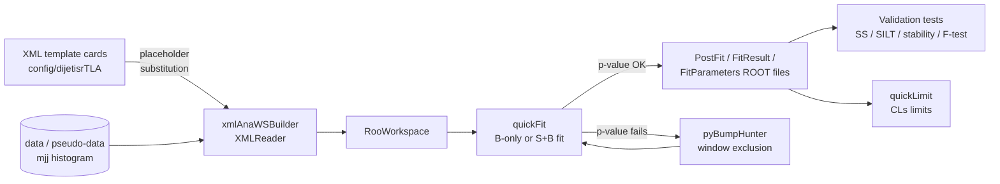

# FrequentistFramework

The **FrequentistFramework** is the statistical toolkit of the early Run 3 **dijet + ISR-photon Trigger-Level Analysis (TLA)** — a search for low-mass $Z'$ dark-matter mediators produced in association with an initial-state photon, using the 2023 TLA stream ($\sqrt{s} = 13.6$ TeV, 25 fb⁻¹, ANA-EXOT-2022-41).

It implements the complete frequentist statistical procedure of the analysis:

- **background-only and signal-plus-background fits** of an $N_\text{par}$-parameter dijet function to the $m_{jj}$ spectrum,
- **BumpHunter** window exclusion for masking localised excesses,
- **pseudo-data (toy) generation** for fit-strategy validation,
- the fit-strategy **validation tests** (spurious signal, signal injection & linearity, background stability, $F$-test),
- **CL$_\text{s}$ limit setting** on Gaussian resonances and on the $Z'$ coupling $g_q$,

all orchestrated according to the staged **unblinding flowchart** of the analysis (4% → 20% → 100% of the dataset).

## Components

The framework is an umbrella around four external packages, cloned and built by the [install script](installation.md):

| Package | Role |
|---|---|
| [`xmlAnaWSBuilder`](https://gitlab.cern.ch/tla-atlas-run3/xmlAnaWSBuilder) | Builds a RooFit workspace (`RooWorkspace`) from XML cards describing data, background and signal models |
| [`quickFit`](https://gitlab.cern.ch/tla-atlas-run3/quickFit) | Performs the (χ²-approximated) likelihood fits and, via `quickLimit`, the CL$_\text{s}$ limit scans |
| [`workspaceCombiner`](https://gitlab.cern.ch/tla-atlas-run3/workspaceCombiner) | Combines/edits workspaces (needed by the shared RooFitExtensions build) |
| [`pyBumpHunter`](https://github.com/scikit-hep/pyBumpHunter) | Python BumpHunter implementation used to find and mask the most discrepant $m_{jj}$ window |

On top of these, the repository provides:

- `python/` — the analysis drivers (`run_anaFit.py`) and all test/plotting utilities,
- `scripts/` — shell wrappers that configure and launch the fits (`run_anaFit.sh` and friends),
- `config/dijetisrTLA/` — XML **template cards** for the dijet+ISR TLA (background functions with 3–10 parameters, Gaussian and parametrised $Z'$ signals),
- `submission/` — HTCondor machinery for the toy-intensive validation tests,
- `data/` — the unblinded data histograms (`data23_histos.root`) and $Z'$ signal shapes,
- `Input/data/dijetisrTLA/` — $m_{jj}$ resolution binning and auxiliary inputs.

## Workflow at a glance



A single invocation of this pipeline is wrapped by `python/run_anaFit.py`, which is in turn configured and called by `scripts/run_anaFit.sh`. Every step of the [unblinding flowchart](statistics/flowcharts.md) is a particular configuration of this pipeline — the [Running the flowchart](flowchart-steps/index.md) section documents exactly which switches to change for each step.

## Quick start

```bash
# on lxplus
setupATLAS
lsetup git
git clone https://:@gitlab.cern.ch:8443/tla-atlas-run3/FrequentistFramework.git --branch tofitsch_baseline_fit
cd FrequentistFramework
. install.sh          # once — clones and builds all sub-packages

# every new shell
. setup.sh

# edit out_dir (and the fit configuration) at the top of scripts/run_anaFit.sh, then
. scripts/run_anaFit.sh
```

See [Installation](installation.md), [Setup](setup.md) and [Running a fit](running.md) for details.

## Statistical procedure

The statistical procedure and unblinding strategy are documented in the analysis note **ANA-EXOT-2022-41-INT1** (Chapters 8, 10 and 11). The [Statistical procedure](statistics/index.md) section of this site summarises it and maps every step onto the framework:

- [Overview](statistics/index.md) — likelihood, dijet fit function, staged unblinding.
- [Validation tests](statistics/validation-tests.md) — spurious signal, signal injection & linearity, background stability, $F$-test.
- [Unblinding flowcharts](statistics/flowcharts.md) — validating a fit strategy, choosing a fit strategy, inspecting partially/fully unblinded data.

## Useful links

- [Falk's tutorial recording (Indico)](https://indico.cern.ch/event/1266089/)
- [Falk's slides (dijet TLA FrequentistFramework docs)](https://gitlab.cern.ch/atlas-phys-exotics-dijet-tla/FrequentistFramework/-/tree/master/doc)
- [JMX unblinding approval (Indico)](https://indico.cern.ch/event/1607958/)
- [tla-ntuple-analysis](https://gitlab.cern.ch/tla-atlas-run3/tla-ntuple-analysis) — produces the input histograms and signal systematics JSON files
- `doc/20210209_CodeWalkthrough.pdf` — code walk-through slides shipped with this repository
