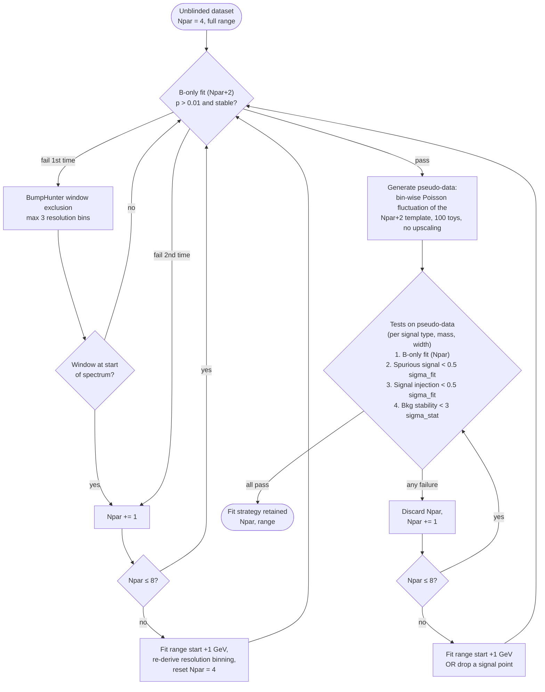
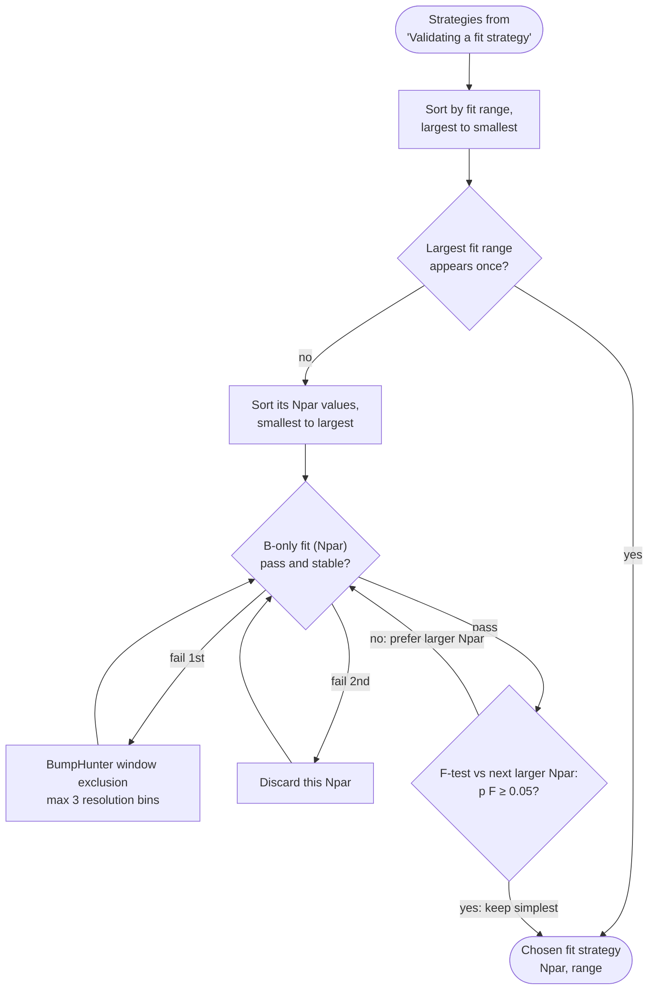
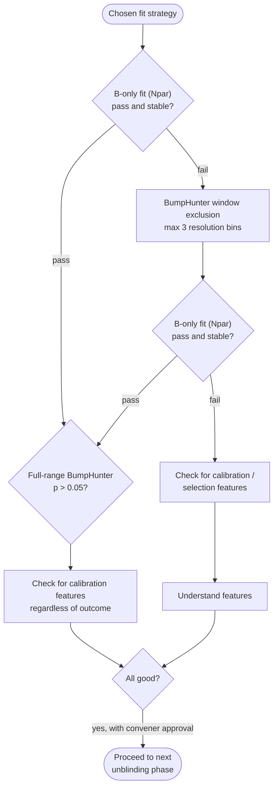
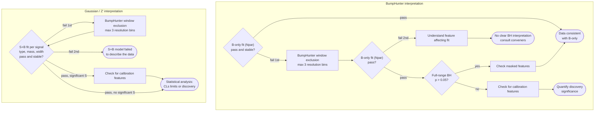

# Unblinding flowcharts

The unblinding procedure (analysis note, Section 10.1, Figures 10.1–10.5) is organised as four flowcharts. The first three are executed **at every unblinding stage** (4%, 20%, 100%); the last one replaces the "inspection" flowchart at the 100% stage. Throughout, *fail* means $p(\chi^2) \le 0.01$ **or** a numerically unstable fit, and every BumpHunter window exclusion is capped at **three $m_{jj}$ resolution bins**.

!!! note "Guidelines, not law"
    The flowcharts are guidelines agreed with the conveners. If the data produces a situation they don't cover, the procedure is adapted in consultation with the conveners rather than followed blindly.

## 1. Validating a fit strategy (Figure 10.1)

Starting point: $N_\text{par} = 4$ and the full fit range (from the 95% trigger-efficiency point; ~85 GeV at the first stage, later 125 GeV).

Key prescriptions:

- **Pseudo-data generation privileges a wide range over low $N_\text{par}$**: only after $N_\text{par} = 8$ fails is the range reduced (by 1 GeV at the lower edge), and the resolution binning is re-derived from the new range start (otherwise BumpHunter masking misbehaves).
- A BumpHunter exclusion sitting **at the beginning of the spectrum** signals a turn-on/selection bias rather than a bump — it is absorbed by increasing $N_\text{par}$, not masked.
- **The test phase privileges increasing $N_\text{par}$ over restricting the range** (the successful B-only fit already validated the range).
- Once a strategy with $N_\text{par} \le 8$ passes, higher $N_\text{par}$ values (up to 8) are also validated so an $F$-test can be made later.
- All passing $(N_\text{par}, \text{range})$ combinations are retained, ordered by ascending range start.

## 2. Choosing a fit strategy (Figure 10.2)

The widest validated fit range wins; among equal ranges the [$F$-test](validation-tests.md#f-test) selects the **lowest $N_\text{par}$** that still describes the data.

## 3. Inspecting partially unblinded data (Figure 10.4 — 4% and 20% stages)

Unblinding proceeds **only after any feature introduced by the jet calibration or analysis selection is understood**.

## 4. Inspecting the fully unblinded data (Figure 10.5 — 100% stage)

Two independent workflows run on the chosen fit strategy:

- The **BumpHunter interpretation** displays the B-only fit and the most discrepant region; discovery significance is quantified from its B-only fit results.
- The **Gaussian/$Z'$ interpretation** performs S+B fits for every signal hypothesis; in the absence of a significant signal, CL$_\text{s}$ limit setting proceeds. Signal properties would be measured with the S+B fits if an excess appears.
- Before the 100% stage the "validating" and "choosing" flowcharts (1 and 2) are re-run **without modification** on the full dataset.

## Visual summary (Figure 10.3)

The first flowchart can be viewed as a scan of the 2D plane spanned by the lower fit boundary $m_{jj}^\text{min}$ (x-axis) and $N_\text{par}$ (y-axis): starting at (85 GeV, $N_\text{par}$ = 4–5), each column is scanned upward through $N_\text{par} \le 8$ with B-only fits; the surviving points are then scanned upward again with the SS/SILT tests; and the passing configuration with the **lowest $m_{jj}^\text{min}$** is selected, to preserve sensitivity to the lowest signal masses.
